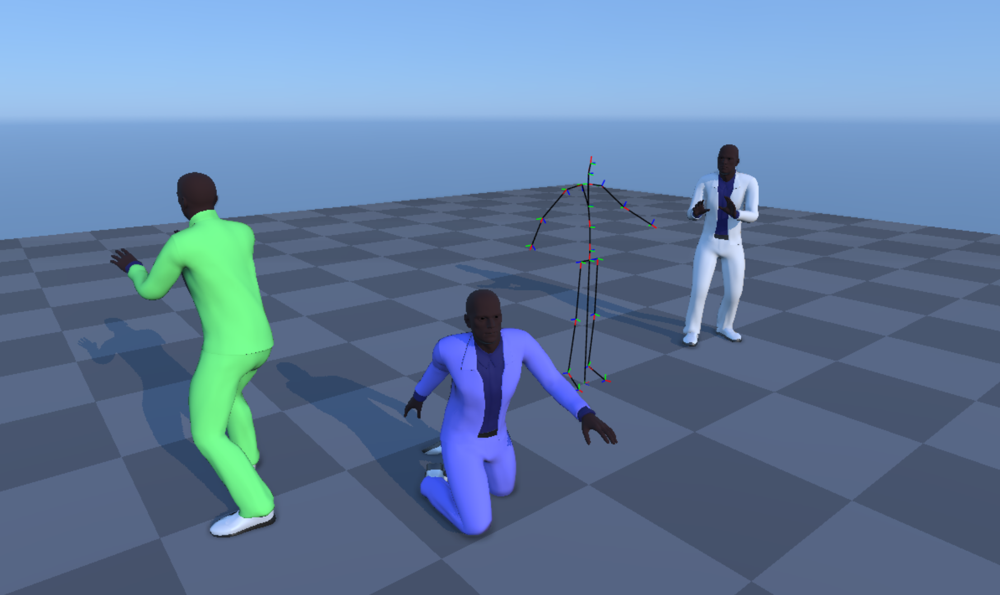
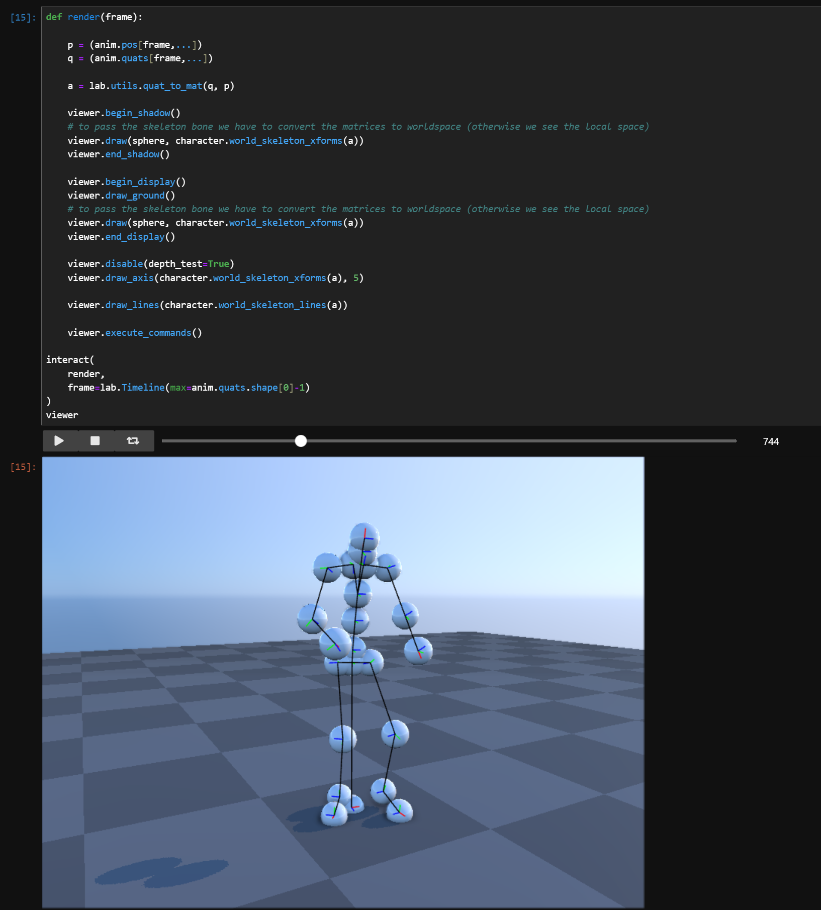

# ipyanimlab

<p align="center">
<br>
A character animation widget for Jupyter Lab
</p>


## Introduction

**ipyanimlab** is jupyter lab library to quickly display character animation when doing animation research.

**OpenUSD** file format to import assets and animations.
* Assets can be rigid or skinned
* skinned asset can support up to 8 bone influences per vertex
* skinned asset are limited to 256 bones at this point (vertex shader skinning)

**BVH** file format is supported to import animations

**Render** with PBR material (no textures), sky with time of day, shadow, ssao

Build on top of [**ipywebgl**](https://pypi.org/project/ipywebgl/) so you can easily write your own shaders and render anything you want.

## Jupter lab

Direct interaction with widgets in your jupyter notebook

<p align="center">
<br>
</p>

## Installation

You can install using `pip`:

```bash
pip install ipyanimlab
```
